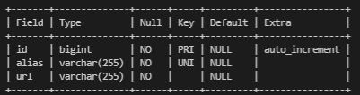

# Welcome!

`Requirements`

- [Click here ](src/main/others/url-shortener.pdf) to view requirement.

`Approach`

User enters an alias in the field and URL and it will generate URL with the alias as the endpoint.

`Technologies used`

- MySql 8.0
- Spring Boot
- React Js
- Docker: to run all 3 services

`Database`

`Running on your localhost (using Docker)`

  `Database`

  	docker run --detach --env MYSQL_ROOT_PASSWORD=root --env MYSQL_DATABASE=url_shortener --env MYSQL_PASSWORD=root --env MYSQL_USER=admin --name localhost --publish 3306:3306 mysql:8.0

  `Spring App`

  	docker run -d -p 8000:8000 --name url_shortener --link localhost:mysql norulshahlam/url-shortener:0.0.1-SNAPSHOT

  `React App`

    docker run -it -p 3000:3000 --name login-app-frontend norulshahlam/url-shortener-frontend:latest

## TEST FULL STACK APP  

By using REST client (Postman)

  `Get all shortened url`

    GET http://localhost:5000/

  `Shorten url`

    POST http://localhost:5000/

    Body -> Raw -> JSON:

      { 
        "alias":"gg",
        "url":"http://www.google.com"
      }  
    
  `To use shortened URLs`

    Simply go to any browser and enter your alias eg:

      localhost:5000/gg

By using frontend

  Simply open any browser and run the URL: [http://localhost:3000/]

## Git Repo

Backend - [https://github.com/norulshahlam/url-shortener-backend]
Frontend - [https://github.com/norulshahlam/url-shortener-client]